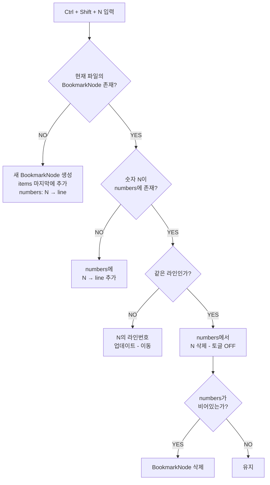
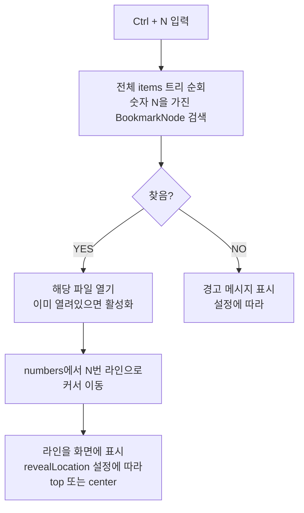
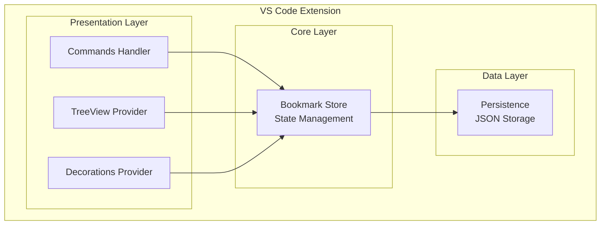

# PRD: VSCode Filemarks Extension

## Product Requirements Document

**Version:** 1.0  
**Date:** 2026-01-04  
**Author:** Development Team  
**Status:** Draft

---

## 1. Executive Summary

### 1.1 Product Overview

**Filemarks**는 Visual Studio Code용 북마크 확장 프로그램으로, 기존의 `vscode-bookmarks`와 `vscode-numbered-bookmarks`의 핵심 기능을 통합하여 더욱 효율적인 코드 네비게이션 경험을 제공합니다.

### 1.2 Problem Statement

개발자들은 대규모 코드베이스에서 중요한 위치를 빠르게 탐색하고 관리하는 데 어려움을 겪습니다. 기존 솔루션들은:
- 숫자 키 기반 빠른 접근(`numbered-bookmarks`)과 유연한 관리 기능(`bookmarks`)이 분리되어 있음
- 두 확장을 동시에 사용하면 충돌 및 혼란 발생
- 북마크 그룹화/폴더 기능 부재

### 1.3 Solution

Filemarks는 다음을 제공합니다:
- **숫자 키 기반 빠른 북마크** (0-9)
- **영속적 북마크 저장** (세션 간 유지)
- **사이드바 기반 시각적 관리**
- **폴더/그룹 기반 북마크 정리**
- **직관적인 CRUD 작업**

---

## 2. Goals & Objectives

### 2.1 Business Goals

| Goal | Success Metric |
|------|----------------|
| 사용자 생산성 향상 | 코드 네비게이션 시간 50% 단축 |
| 기존 확장 대체 | bookmarks + numbered-bookmarks 사용자 마이그레이션 |
| 사용자 만족도 | VSCode Marketplace 평점 4.5+ |

### 2.2 User Goals

- 중요한 코드 위치를 빠르게 마킹하고 접근
- 북마크를 논리적으로 그룹화하여 관리
- 프로젝트 간 북마크 영속성 보장
- 직관적인 UI를 통한 북마크 관리

### 2.3 Non-Goals (Out of Scope for v1.0)

- 북마크 공유/협업 기능
- 클라우드 동기화
- 북마크 내보내기/가져오기 (v2.0 예정)
- 코드 스니펫 연동

---

## 3. Functional Requirements

### 4.1 Core Features

#### FR-001: 숫자 키 북마크 토글

| Attribute | Description |
|-----------|-------------|
| **ID** | FR-001 |
| **Priority** | P0 (Must Have) |
| **Description** | 사용자가 키보드 단축키로 현재 커서 위치에 숫자 북마크(0-9)를 설정/해제 |
| **Trigger** | `Ctrl + Shift + [0-9]` (Windows/Linux), `Cmd + Shift + [0-9]` (macOS) |
| **Acceptance Criteria** | <ul><li>10개의 숫자 북마크(0-9) 지원</li><li>파일당 하나의 BookmarkNode, 여러 숫자 북마크 포함 가능</li><li>거터(gutter)에 숫자 아이콘 표시</li></ul> |

**상세 동작 흐름:**



**동작 시나리오 예시:**

| 순서 | 동작 | 현재 상태 | 결과 |
|------|------|-----------|------|
| 1 | `src/app.ts:30`에서 `Ctrl+Shift+4` | BookmarkNode 없음 | 새 노드 생성: `{ filePath: "src/app.ts", numbers: { 4: 30 } }` |
| 2 | `src/app.ts:50`에서 `Ctrl+Shift+8` | 노드 존재, 8번 없음 | 추가: `numbers: { 4: 30, 8: 50 }` |
| 3 | `src/app.ts:70`에서 `Ctrl+Shift+4` | 노드 존재, 4번=30 | 이동: `numbers: { 4: 70, 8: 50 }` |
| 4 | `src/app.ts:70`에서 `Ctrl+Shift+4` | 노드 존재, 4번=70 | 삭제(토글): `numbers: { 8: 50 }` |
| 5 | `src/app.ts:50`에서 `Ctrl+Shift+8` | 노드 존재, 8번=50 | 삭제(토글): `numbers: {}` → 노드 삭제 |
| 6 | `src/new.ts:10`에서 `Ctrl+Shift+1` | 해당 파일 노드 없음 | 새 노드 생성, `items` 마지막에 추가 |

#### FR-002: 숫자 키 북마크 점프

| Attribute | Description |
|-----------|-------------|
| **ID** | FR-002 |
| **Priority** | P0 (Must Have) |
| **Description** | 사용자가 키보드 단축키로 특정 숫자 북마크 위치로 즉시 이동 |
| **Trigger** | `Ctrl + [0-9]` (Windows/Linux), `Cmd + [0-9]` (macOS) |
| **Acceptance Criteria** | <ul><li>다른 파일의 북마크도 점프 가능</li><li>북마크 없을 시 알림 표시 (설정 가능)</li><li>점프 후 라인이 화면 중앙에 표시</li></ul> |

**상세 동작 흐름:**



**점프 동작 예시:**

| 현재 상태 | 동작 | 결과 |
|-----------|------|------|
| `src/app.ts` 열려있음, 4번=`src/utils.ts:25` | `Ctrl+4` | `src/utils.ts` 열고 25번 라인으로 이동 |
| `src/app.ts` 열려있음, 4번=`src/app.ts:30` | `Ctrl+4` | 같은 파일 내 30번 라인으로 이동 |
| 4번 북마크 없음 | `Ctrl+4` | "Bookmark 4 is not defined" 경고 (설정 시) |

#### FR-003: 북마크 영속성

| Attribute | Description |
|-----------|-------------|
| **ID** | FR-003 |
| **Priority** | P0 (Must Have) |
| **Description** | 북마크가 파일/세션을 닫아도 유지됨 |
| **Storage** | `.vscode/filemarks.json` |
| **Behavior** | <ul><li>프로젝트별 저장</li><li>VS Code 재시작 후에도 유지</li><li>파일 이름 변경 시 북마크 업데이트</li></ul> |
| **Acceptance Criteria** | <ul><li>VS Code 종료 후 재시작해도 북마크 유지</li><li>파일 삭제 시 관련 북마크 자동 제거</li><li>라인 삭제/추가 시 북마크 위치 자동 조정 (Sticky)</li></ul> |

#### FR-004: 사이드바 북마크 뷰

| Attribute | Description |
|-----------|-------------|
| **ID** | FR-004 |
| **Priority** | P0 (Must Have) |
| **Description** | 전용 사이드바에서 모든 북마크 확인 및 관리 |
| **UI Elements** | <ul><li>Activity Bar 아이콘</li><li>TreeView 기반 북마크 목록</li><li>폴더/그룹 계층 구조</li></ul> |
| **Acceptance Criteria** | <ul><li>모든 북마크를 트리 형태로 표시</li><li>북마크 클릭 시 해당 위치로 이동</li><li>파일별 그룹핑 지원</li><li>북마크 카운트 배지 표시</li></ul> |

#### FR-005: 북마크 이름 지정/변경

| Attribute | Description |
|-----------|-------------|
| **ID** | FR-005 |
| **Priority** | P1 (Should Have) |
| **Description** | 북마크에 사용자 정의 이름(라벨) 지정 |
| **Trigger** | <ul><li>북마크 생성 시 라벨 입력 (선택)</li><li>사이드바에서 우클릭 → "Rename"</li></ul> |
| **Acceptance Criteria** | <ul><li>라벨 없이도 북마크 생성 가능</li><li>기본 라벨: 해당 라인 코드 내용</li><li>라벨 검색 기능</li></ul> |

#### FR-006: 폴더/그룹 관리

| Attribute | Description |
|-----------|-------------|
| **ID** | FR-006 |
| **Priority** | P1 (Should Have) |
| **Description** | 북마크를 폴더(그룹)로 정리 |
| **Operations** | <ul><li>폴더 생성/삭제/이름변경</li><li>북마크를 폴더로 이동</li><li>폴더 간 북마크 이동</li></ul> |
| **Acceptance Criteria** | <ul><li>드래그앤드롭으로 북마크 이동</li><li>폴더 축소/확장</li><li>폴더 내 북마크 일괄 삭제</li></ul> |

#### FR-007: 북마크 CRUD 작업

| Attribute | Description |
|-----------|-------------|
| **ID** | FR-007 |
| **Priority** | P0 (Must Have) |
| **Description** | 사이드바에서 북마크 수정/삭제/이동 |
| **Operations** | <ul><li>**Create:** 커맨드 또는 단축키</li><li>**Read:** 사이드바 목록</li><li>**Update:** 이름 변경, 위치 이동</li><li>**Delete:** 개별/일괄 삭제</li></ul> |
| **Context Menu** | <ul><li>Go to Bookmark</li><li>Rename</li><li>Move to Folder</li><li>Delete</li></ul> |

### 4.2 Additional Features

#### FR-008: 북마크 목록 커맨드

| Attribute | Description |
|-----------|-------------|
| **ID** | FR-008 |
| **Priority** | P2 (Nice to Have) |
| **Description** | Command Palette에서 북마크 목록 확인 및 점프 |
| **Commands** | <ul><li>`Filemarks: List` - 현재 파일 북마크</li><li>`Filemarks: List All` - 모든 파일 북마크</li></ul> |

#### FR-009: 북마크 전체 삭제

| Attribute | Description |
|-----------|-------------|
| **ID** | FR-009 |
| **Priority** | P2 (Nice to Have) |
| **Description** | 북마크 일괄 삭제 기능 |
| **Commands** | <ul><li>`Filemarks: Clear` - 현재 파일 북마크 삭제</li><li>`Filemarks: Clear All` - 모든 북마크 삭제</li></ul> |

---

## 4. Non-Functional Requirements

### 4.1 Performance

| Requirement | Target |
|-------------|--------|
| 북마크 점프 반응 시간 | < 100ms |
| 사이드바 로딩 시간 | < 500ms (북마크 1000개 기준) |
| 메모리 사용량 | < 50MB |
| 확장 활성화 시간 | < 200ms |

### 4.2 Reliability

| Requirement | Description |
|-------------|-------------|
| 데이터 무결성 | 북마크 데이터 손실 방지 |
| 에러 핸들링 | 파일 삭제/이동 시 graceful 처리 |
| 복구 | 손상된 데이터 자동 복구 시도 |

### 4.3 Compatibility

| Requirement | Target |
|-------------|--------|
| VS Code 버전 | ^1.85.0 |
| OS 지원 | Windows, macOS, Linux |
| Remote Development | SSH, WSL, Container 지원 |
| Multi-root Workspace | 지원 |

### 4.4 Usability

| Requirement | Description |
|-------------|-------------|
| 키보드 접근성 | 모든 기능 키보드로 접근 가능 |
| 단축키 충돌 | 기본 VS Code 단축키와 충돌 최소화 |
| 국제화 | 영어, 한국어 지원 (v1.0) |

---

## 5. Technical Specifications

### 5.1 Architecture



### 5.2 Data Model

```typescript
// 트리 노드 타입 (재귀적 구조)
type TreeNode = FolderNode | BookmarkNode;

interface FolderNode {
  type: 'folder';
  id: string;                    // UUID
  name: string;                  // 폴더 이름
  children: TreeNode[];          // 하위 폴더 또는 북마크 (재귀)
  expanded?: boolean;            // UI 확장 상태
  createdAt: string;             // ISO 8601
  updatedAt: string;             // ISO 8601
}

interface BookmarkNode {
  type: 'bookmark';
  id: string;                    // UUID
  label?: string;                // 사용자 정의 라벨 (파일 레벨)
  filePath: string;              // 상대 경로
  numbers: Record<number, number>; // { [숫자키 0-9]: 라인번호 }
                                 // 예: { 1: 25, 3: 100 } → 1번=25라인, 3번=100라인
  createdAt: string;             // ISO 8601
  updatedAt: string;             // ISO 8601
}

// 동작 설명:
// - 파일에서 처음 Ctrl+Shift+[숫자] → 새 BookmarkNode 생성, items 마지막에 추가
// - 같은 파일에서 다른 숫자 → 기존 BookmarkNode의 numbers에 추가
// - 같은 파일, 같은 숫자 → 해당 라인번호 업데이트 (이동)

interface FilemarkState {
  version: string;               // 스키마 버전
  items: TreeNode[];             // 루트 레벨 아이템들 (폴더 또는 북마크)
}
```

### 5.3 Storage

```json
// .vscode/filemarks.json
{
  "version": "1.0",
  "items": [
    {
      "type": "folder",
      "id": "folder-1",
      "name": "Entry Points",
      "expanded": true,
      "createdAt": "2026-01-04T10:00:00Z",
      "updatedAt": "2026-01-04T10:00:00Z",
      "children": [
        {
          "type": "bookmark",
          "id": "uuid-1",
          "label": "Extension Core",
          "filePath": "src/extension.ts",
          "numbers": {
            "1": 25,
            "3": 100,
            "7": 150
          },
          "createdAt": "2026-01-04T10:00:00Z",
          "updatedAt": "2026-01-04T10:00:00Z"
        },
        {
          "type": "folder",
          "id": "folder-2",
          "name": "Nested Folder",
          "expanded": false,
          "createdAt": "2026-01-04T10:00:00Z",
          "updatedAt": "2026-01-04T10:00:00Z",
          "children": [
            {
              "type": "bookmark",
              "id": "uuid-2",
              "filePath": "src/utils.ts",
              "numbers": {
                "2": 10,
                "5": 45
              },
              "createdAt": "2026-01-04T10:00:00Z",
              "updatedAt": "2026-01-04T10:00:00Z"
            }
          ]
        }
      ]
    },
    {
      "type": "bookmark",
      "id": "uuid-3",
      "label": "App Entry",
      "filePath": "src/index.ts",
      "numbers": {
        "0": 1
      },
      "createdAt": "2026-01-04T10:00:00Z",
      "updatedAt": "2026-01-04T10:00:00Z"
    }
  ]
}
```

> 📌 상세 동작 흐름은 [FR-001: 숫자 키 북마크 토글](#fr-001-숫자-키-북마크-토글) 참조

### 5.4 Commands & Keybindings

| Command ID | Title | Default Keybinding |
|------------|-------|-------------------|
| `filemarks.toggleBookmark0` | Toggle Bookmark 0 | `Ctrl+Shift+0` |
| `filemarks.toggleBookmark1` | Toggle Bookmark 1 | `Ctrl+Shift+1` |
| ... | ... | ... |
| `filemarks.toggleBookmark9` | Toggle Bookmark 9 | `Ctrl+Shift+9` |
| `filemarks.jumpToBookmark0` | Jump to Bookmark 0 | `Ctrl+0` |
| `filemarks.jumpToBookmark1` | Jump to Bookmark 1 | `Ctrl+1` |
| ... | ... | ... |
| `filemarks.jumpToBookmark9` | Jump to Bookmark 9 | `Ctrl+9` |
| `filemarks.toggleBookmark` | Toggle Bookmark | `Ctrl+Alt+K` |
| `filemarks.toggleLabeledBookmark` | Toggle Labeled Bookmark | `Ctrl+Alt+L` |
| `filemarks.list` | List Bookmarks | - |
| `filemarks.listAll` | List All Bookmarks | - |
| `filemarks.clear` | Clear Bookmarks | - |
| `filemarks.clearAll` | Clear All Bookmarks | - |
| `filemarks.createFolder` | Create Folder | - |

### 5.5 Configuration Options

```json
{
  "filemarks.saveBookmarksInProject": {
    "type": "boolean",
    "default": true,
    "description": "Save bookmarks in .vscode folder"
  },
  "filemarks.navigateThroughAllFiles": {
    "type": "string",
    "enum": ["false", "replace", "allowDuplicates"],
    "default": "replace",
    "description": "How numbered bookmarks behave across files"
  },
  "filemarks.gutterIconFillColor": {
    "type": "string",
    "default": "#157EFB",
    "description": "Gutter icon fill color"
  },
  "filemarks.gutterIconNumberColor": {
    "type": "string",
    "default": "#FFFFFF",
    "description": "Gutter icon number color"
  },
  "filemarks.showBookmarkNotDefinedWarning": {
    "type": "boolean",
    "default": true,
    "description": "Show warning when jumping to undefined bookmark"
  },
  "filemarks.sideBar.expanded": {
    "type": "boolean",
    "default": true,
    "description": "Start sidebar expanded"
  },
  "filemarks.revealLocation": {
    "type": "string",
    "enum": ["top", "center"],
    "default": "center",
    "description": "Where to reveal bookmarked line"
  }
}
```

---

## 6. User Interface Design

### 6.1 Sidebar TreeView

```
📑 FILEMARKS
├── 📁 Entry Points
│   ├── 1️⃣ Main Entry Point (extension.ts:25)
│   └── 2️⃣ Command Handler (commands.ts:10)
├── 📁 Utils
│   └── 🔖 Helper Function (utils.ts:45)
├── 📄 src/bookmark.ts
│   ├── 3️⃣ Bookmark Class (bookmark.ts:5)
│   └── 🔖 Save Method (bookmark.ts:120)
└── 📄 src/storage.ts
    └── 🔖 Load Function (storage.ts:15)
```

### 6.2 Gutter Icons

```
    ┌────┬────────────────────────────────
 24 │    │ // Some code
 25 │ ①  │ export function activate() {
 26 │    │   // ...
 27 │ ②  │   registerCommands();
 28 │    │ }
    └────┴────────────────────────────────
      │
      └── 숫자 북마크 아이콘 (원 안에 숫자)
```

### 6.3 Context Menu

```
┌─────────────────────────┐
│ 🚀 Go to Bookmark       │
├─────────────────────────┤
│ ✏️  Rename              │
│ 📁 Move to Folder...    │
├─────────────────────────┤
│ 🗑️  Delete              │
└─────────────────────────┘
```

---

## 7. Development Roadmap

### Phase 1: MVP (v0.1.0) - Week 1-2

| Feature | Priority | Status |
|---------|----------|--------|
| 숫자 북마크 토글 (0-9) | P0 | 🔲 |
| 숫자 북마크 점프 (0-9) | P0 | 🔲 |
| 기본 영속성 (.vscode) | P0 | 🔲 |
| 거터 아이콘 표시 | P0 | 🔲 |

### Phase 2: Core Features (v0.2.0) - Week 3-4

| Feature | Priority | Status |
|---------|----------|--------|
| 사이드바 TreeView | P0 | 🔲 |
| 북마크 클릭으로 이동 | P0 | 🔲 |
| 북마크 삭제 | P0 | 🔲 |
| 북마크 이름 지정/변경 | P1 | 🔲 |

### Phase 3: Advanced Features (v0.3.0) - Week 5-6

| Feature | Priority | Status |
|---------|----------|--------|
| 폴더/그룹 기능 | P1 | 🔲 |
| 드래그앤드롭 이동 | P1 | 🔲 |
| 북마크 목록 커맨드 | P2 | 🔲 |
| Sticky 북마크 (라인 추적) | P1 | 🔲 |

### Phase 4: Polish (v1.0.0) - Week 7-8

| Feature | Priority | Status |
|---------|----------|--------|
| 설정 옵션 완성 | P1 | 🔲 |
| 에러 핸들링 강화 | P1 | 🔲 |
| 국제화 (i18n) | P2 | 🔲 |
| 문서화 | P1 | 🔲 |
| 테스트 커버리지 80%+ | P1 | 🔲 |

---

## 8. Success Metrics

### 8.1 Quantitative Metrics

| Metric | Target | Measurement |
|--------|--------|-------------|
| 일일 활성 사용자 (DAU) | 1,000+ (출시 3개월 후) | VS Code Telemetry |
| 설치 수 | 10,000+ (출시 6개월 후) | Marketplace |
| 평점 | 4.5+ / 5.0 | Marketplace |
| 버그 리포트 | < 10/month | GitHub Issues |

### 8.2 Qualitative Metrics

- 사용자 피드백 긍정적 비율: 80%+
- 기능 요청 구현율: 50%+ (합리적 요청)
- 응답 시간: Issue 48시간 내 응답

---

## 9. Risks & Mitigations

| Risk | Impact | Probability | Mitigation |
|------|--------|-------------|------------|
| 기존 확장과 단축키 충돌 | High | Medium | 사용자 정의 가능한 키바인딩 제공 |
| 대규모 프로젝트 성능 저하 | High | Low | 지연 로딩, 가상화 적용 |
| 데이터 손실 | High | Low | 자동 백업, 복구 메커니즘 |
| VS Code API 변경 | Medium | Low | API 변경 모니터링, 버전 호환성 테스트 |

---

## 10. Dependencies

### 10.1 External Dependencies

| Dependency | Purpose | Version |
|------------|---------|---------|
| VS Code Extension API | 핵심 확장 기능 | ^1.85.0 |
| uuid | 고유 ID 생성 | ^9.0.0 |

### 10.2 Development Dependencies

| Dependency | Purpose |
|------------|---------|
| TypeScript | 타입 안전성 |
| esbuild | 번들링 |
| @vscode/test-electron | 테스트 |
| ESLint | 코드 품질 |

---

## 11. References

### 11.1 Existing Solutions

- [vscode-bookmarks](https://github.com/alefragnani/vscode-bookmarks) - 일반 북마크 기능
- [vscode-numbered-bookmarks](https://github.com/alefragnani/vscode-numbered-bookmarks) - 숫자 키 북마크

### 11.2 VS Code Documentation

- [Extension API](https://code.visualstudio.com/api)
- [TreeView API](https://code.visualstudio.com/api/extension-guides/tree-view)
- [Decorations API](https://code.visualstudio.com/api/references/vscode-api#TextEditorDecorationType)

---

## Appendix A: Glossary

| Term | Definition |
|------|------------|
| **Bookmark** | 코드 내 특정 위치를 표시하는 마커 |
| **Numbered Bookmark** | 0-9 숫자 키로 접근 가능한 북마크 |
| **Folder/Group** | 북마크를 논리적으로 그룹화하는 컨테이너 |
| **Gutter** | 에디터 라인 번호 옆 영역 |
| **TreeView** | 계층적 데이터를 표시하는 UI 컴포넌트 |
| **Sticky Bookmark** | 코드 변경 시 위치가 자동 추적되는 북마크 |

---

## Appendix B: Revision History

| Version | Date | Author | Changes |
|---------|------|--------|---------|
| 1.0 | 2026-01-04 | Dev Team | Initial PRD |
