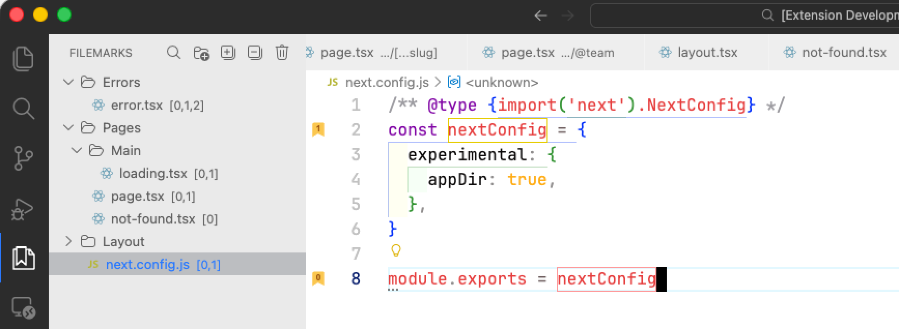

# Filemarks

[](https://opensource.org/licenses/MIT)

> **Numbered bookmarks with folder organization for VS Code**

Filemarks is a powerful bookmark extension that lets you quickly navigate your code using numbered shortcuts (0-9) with visual gutter icons and organize bookmarks into folders.



## Features

### 🔢 Numbered Bookmarks (0-9)

Quickly set and jump to up to 10 bookmarks per file using keyboard shortcuts.

| Action            | Windows/Linux    | macOS           |
| ----------------- | ---------------- | --------------- |
| Toggle Bookmark   | `Ctrl+Alt+[0-9]` | `Cmd+Alt+[0-9]` |
| Jump to Bookmark  | `Ctrl+[0-9]`     | `Cmd+[0-9]`     |
| Auto Bookmark     | `Ctrl+Alt+P`     | `Cmd+Alt+P`     |
| Previous Bookmark | `Ctrl+Alt+[`     | `Cmd+Alt+[`     |
| Next Bookmark     | `Ctrl+Alt+]`     | `Cmd+Alt+]`     |

### 🔖 Visual Gutter Icons

- Bookmark-shaped icons with numbers displayed in the editor gutter
- Customizable colors (default: yellow/gold background, brown number)
- Instantly see which lines are bookmarked

### 🔍 Search & Filter

- Real-time fuzzy search across all bookmarks
- Filter by bookmark name or file path
- Search results update as you type
- Visual indicator when filter is active

### 📁 Folder Organization

- Create folders to organize your bookmarks
- Drag and drop bookmarks between folders
- Drop bookmark onto another bookmark to move to same folder
- Hierarchical structure for complex projects
- Create subFolders within folders (right-click folder)


### 🎛️ Sidebar Controls

Quick access buttons in the sidebar title bar:

| Button        | Icon | Description                               |
| ------------- | ---- | ----------------------------------------- |
| Search        | 🔍   | Open search input for filtering           |
| Clear Search  | ⊗    | Clear active filter (visible when active) |
| Create Folder | `+`  | Create a new folder                       |
| Expand All    | `⊞`  | Expand all folders                        |
| Collapse All  | `⊟`  | Collapse all folders                      |
| Clear All     | 🗑   | Delete all bookmarks                      |

### 📂 File Icons

- Sidebar displays consistent file icons for all bookmarks
- Easily identify bookmarked files at a glance
- Drag bookmarks to editor area to open files
- Right-click files in Explorer to add bookmarks

### 🔄 Smart Features

| Feature                      | Description                                        |
| ---------------------------- | -------------------------------------------------- |
| **Auto Bookmark**            | Automatically assigns next available number (0-9)  |
| **Sticky Bookmarks**         | Line numbers auto-adjust when you edit code        |
| **Auto-cleanup**             | Bookmarks removed when files are deleted           |
| **Invalid Line Removal**     | Bookmarks removed when lines no longer exist       |
| **Per-workspace Storage**    | Each project has its own bookmarks                 |
| **Folder State Persistence** | Folder expand/collapse state is saved and restored |
| **Drag to Editor**           | Drag bookmark from sidebar to editor to open file  |

### 🌍 Internationalization

- English
- Korean (한국어)

## Installation

1. Open VS Code
2. Press `Ctrl+P` / `Cmd+P`
3. Type `ext install nicegyuha.filemarks`
4. Press Enter

## Quick Start

1. **Set a bookmark**: Place cursor on a line, press `Ctrl+Alt+1`
2. **Auto bookmark**: Press `Ctrl+Alt+P` to auto-assign next available number
3. **Jump to bookmark**: Press `Ctrl+1` to jump back
4. **Navigate bookmarks**: Press `Ctrl+Alt+]` for next, `Ctrl+Alt+[` for previous
5. **Search bookmarks**: Click the search icon in sidebar to filter bookmarks
6. **Focus sidebar**: Press `Ctrl+Shift+B` to focus the Filemarks sidebar
7. **Organize**: Drag and drop bookmarks into folders, or right-click → "Move to Folder"
8. **Add from Explorer**: Right-click any file in Explorer → "Add Bookmark"

## Commands

| Command                                      | Description                                |
| -------------------------------------------- | ------------------------------------------ |
| `Filemarks: Toggle Bookmark [0-9]`           | Set/unset numbered bookmark                |
| `Filemarks: Jump to Bookmark [0-9]`          | Navigate to bookmark                       |
| `Filemarks: Auto Bookmark`                   | Create bookmark with next available number |
| `Filemarks: Jump to Previous Bookmark`       | Navigate to previous bookmark              |
| `Filemarks: Jump to Next Bookmark`           | Navigate to next bookmark                  |
| `Filemarks: Search Bookmarks`                | Open search input to filter bookmarks      |
| `Filemarks: Clear Search`                    | Clear active search filter                 |
| `Filemarks: List Bookmarks in Current File`  | Show all bookmarks in file                 |
| `Filemarks: List All Bookmarks`              | Show all bookmarks in workspace            |
| `Filemarks: Create Folder`                   | Create organization folder                 |
| `Filemarks: Expand All Folders`              | Expand all folders in sidebar              |
| `Filemarks: Collapse All Folders`            | Collapse all folders in sidebar            |
| `Filemarks: Focus Sidebar`                   | Focus the Filemarks sidebar                |
| `Filemarks: Clear Bookmarks in Current File` | Remove all bookmarks from file             |
| `Filemarks: Clear All Bookmarks`             | Remove all bookmarks                       |
| `Filemarks: Add Bookmark from Explorer`      | Add bookmark to file from Explorer         |

## Configuration

| Setting                                   | Default     | Description                                                                  |
| ----------------------------------------- | ----------- | ---------------------------------------------------------------------------- |
| `filemarks.saveBookmarksInProject`        | `false`     | Save in `.vscode/filemarks.json`                                             |
| `filemarks.navigateThroughAllFiles`       | `false`     | Navigate within current file (false) or across all files (true) when jumping |
| `filemarks.showBookmarkNotDefinedWarning` | `true`      | Show warning for undefined bookmarks                                         |
| `filemarks.revealLocation`                | `"center"`  | Cursor position after jump (`"center"` or `"top"`)                           |
| `filemarks.gutterIconFillColor`           | `"#FBC74F"` | Bookmark icon background color                                               |
| `filemarks.gutterIconNumberColor`         | `"#A05A14"` | Bookmark icon number color                                                   |

### Custom Colors Example

```json
{
  "filemarks.gutterIconFillColor": "#3498DB",
  "filemarks.gutterIconNumberColor": "#FFFFFF"
}
```

## Storage

Bookmarks are stored in `.vscode/filemarks.json` by default:

- ✅ Share with team via version control
- ✅ Project-specific bookmarks
- ✅ Automatic backup with project

Set `filemarks.saveBookmarksInProject` to `false` for global storage.

## Sidebar View

Access the Filemarks view from the Activity Bar:

- 🔍 Search and filter bookmarks in real-time
- 📁 Hierarchical folder structure with file-type icons
- 🖱️ Click to jump to bookmark
- 🔀 Drag & drop to organize (onto folders or other bookmarks)
- 📂 Drag to editor area to open file
- 📋 Right-click for context menu
- ➕ Add bookmarks directly from Explorer context menu

## Keyboard Shortcuts Summary

### Windows / Linux

| Shortcut                    | Action                  |
| --------------------------- | ----------------------- |
| `Ctrl+Alt+0` ~ `Ctrl+Alt+9` | Toggle bookmark 0-9     |
| `Ctrl+0` ~ `Ctrl+9`         | Jump to bookmark 0-9    |
| `Ctrl+Alt+P`                | Auto bookmark           |
| `Ctrl+Alt+[`                | Previous bookmark       |
| `Ctrl+Alt+]`                | Next bookmark           |
| `Ctrl+Shift+B`              | Focus Filemarks sidebar |

### macOS

| Shortcut                  | Action                  |
| ------------------------- | ----------------------- |
| `Cmd+Alt+0` ~ `Cmd+Alt+9` | Toggle bookmark 0-9     |
| `Cmd+0` ~ `Cmd+9`         | Jump to bookmark 0-9    |
| `Cmd+Alt+P`               | Auto bookmark           |
| `Cmd+Alt+[`               | Previous bookmark       |
| `Cmd+Alt+]`               | Next bookmark           |
| `Cmd+Shift+B`             | Focus Filemarks sidebar |

## Requirements

- VS Code 1.85.0 or higher

## Release Notes

See [CHANGELOG.md](CHANGELOG.md) for version history.

## Issues & Feedback

Found a bug or have a suggestion? [Open an issue](https://github.com/gyuha/vscode-filemarks/issues)

## License

[MIT](LICENSE)

---

**Made with ❤️ by [Gyuha](https://github.com/gyuha)**
